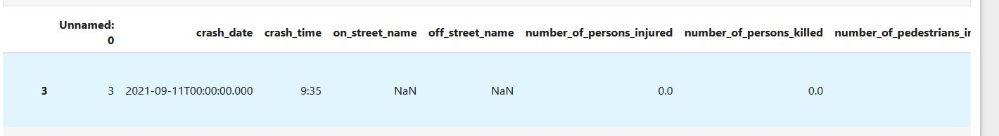
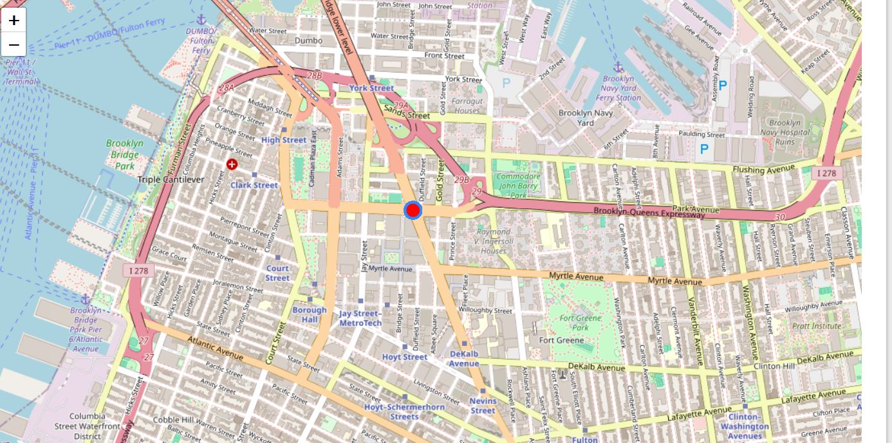

# NYC MVA Project
#### By Robert Rose, Cataldo Cocuzza, Adrian Dayrit

# Overview:
Our project proposal was to find different trends and patterns for motor vehicle accidents in New York City using the data from [Data.gov - NYC Motor Vehicle Crashes](https://catalog.data.gov/dataset/motor-vehicle-collisions-crashes "NYC MVA Data"). 

Prior to starting the project, we had two hypotheses:
1. The pandemic impacted traffic in an obvious way, and that traffic accidents increased afterwards.
2. Driver inattention would dominate the causes.

Additionally, we had a few other interesting details we wanted to find, such as:
- Top causes
- Accident hot spots
- Borough data
- Car vehicle type
- Time of day
- Pandemic trends
- Safest and least safe intersections


# Obtaining Data
To obtain the data, we used the sodapy python library to run our GET from the API. Sodapy was recommended instead of requests and in fact worked better in terms of allowing us to write the query for the subset we wanted to obtain.

```
%pip install sodapy

from sodapy import Socrata

txt = open('app_token.txt', 'r')
app_token = txt.read()
txt.close()

client = Socrata("data.cityofnewyork.us", app_token)
results = client.get("h9gi-nx95", limit=1000000, where="crash_date=2017-01-01T00:00:00.000")

```

From here we put the data into a .CSV so we did not have to hammer the API for every run.

Notes:
- Requests did work but due to the volume of data it would crash Jupyter Notebook.
- We decided to limit the GET to 1,000,000 rows of data start on 1/1/2017.
	- Data included, but wasn't limited to, the following fields:
		- Crash date/time
		- Street name/borough
		- Number of people injured/killed
		- Contributing factor
		- Type of vehicles
- Our data seemed to taper off sometime around mid 2022.

To work with our data, we used the [NYC Open Data API](https://data.cityofnewyork.us/Public-Safety/Motor-Vehicle-Collisions-Crashes/h9gi-nx95 "NYC MVA Data") to obtain data and ultimately save it to .CSV format to read.

# Formatting the Data

Once we obtained our data, we made some formatting changes as well as scrubbing out some of the rows that we felt wouldn't be very useful to us. For example:



Note the column "Unnamed: 0", the NaN's in certain columns, as well as the date/time formatting. For our project: 
- We want as much location data as possible so we dropped rows without any location data. 
- We want the contributing factors, so we dropped any rows with null contributing factors.
- We don't need the "Unnamed: 0" - I believe that's something from the .CSV import.
- Lastly the time stamp in the "crash_date" column is pointless, so we formatted this out.


As you can see above, we now have a useful dataset. This scrubbing resulted in the elimination of approximately 55% of our dataset.

# Findings

From here we went on to try and discover some of the significance within the data as well as prove our hypotheses.

## Hypothesis #1 - Pandemic Impact

When we started the project we had the idea that since it seems people like to complain that drivers have become worse after the pandemic, we might be able to prove this by seeing some sort of trend or increase above the pre-pandemic levels. Unfortunately, our data did not extend far beyond mid-2022. But curiously, as things began to "open up" in 2022, we didn't see much of an increase. We could attribute this to many still working from home or locking down, but it's hard to say for certain.


Notes:
- Accidents held steady ranging from ~8k to ~10k accidents per year from 2017 to 2020.
- Once the pandemic hit in 2020, there were ~2k accidents during that year
- Once things started to open back up from 2021 to 2023, accidents remained steady from ~3.5k to ~4k accidents per year.

## Accidents in the Morning/Afternoon vs Evening/Night

The first thing we did is look to see what the total number of accidents during the "day" vs the "night". We define "day" as the time between 6am and 6pm.

As you can see below, a significant number of accidents occur during the day. This isn't terribly shocking as a vast majority of driving occurs during the day. But this sets a baseline for our further exploration.


## Hypothesis #2 - Distracted Driving Significance

Our second hypothesis is that distracted driving would cause most accidents. With the plethora of distractions within the vehicles including our own phones, it seemed logical to hypothesize that this cause would be at the top. What we did not expect was how disproportionate this would be to every other cause.

We decided to split this data using our day/night rules discussed previously.

Interestingly, the cause doesn't vary much between day:


and Night:


The only notable increase is that alcohol jumps the list at night.

## Vehicle Types
The vehicle type data isn't terribly shocking due to the fact that the most popular types top the list. It's unclear whether every "Taxi" accident is recorded as a "Taxi" or a "Sedan".


Note that motorcycles are at the bottom of the list. But on the graph below, the jump the list. 


As you can see, and probably assumed, a disproportionate amount of fatalities belong to the motorcycle groups.

## Borough Data

We took a look at the borough data and it showed that our most populace boroughs topped the list. Brooklyn and queens have a similar population and size where Manhattan is about 20% of the size of either one with half the population. However, it's estimated that Manhattan sees as many as 2.5 million non-residents daily, not all of which are driving. But the added activity likely contributes to where they are on the list.


## Date/Time Findings

Looking at the accidents by days or months you'll see that the correlation between volumes and fatalities is fairly tight. We did see that May does have a decreased amount of fatalities relative to the number of accidents, while accidents and fatalities peak in June.


Week in and week out you'll see that Friday's tend to bring out the worst in drivers. While weekends tends to be relatively light. This may once again be due to volume.


## Heatmap

We thought it might be interesting to use our location data and determine if there was anything that came to our attention with some exploratory analysis.

The first thing we did was create a heatmap using the Latitude / Longitude information. To leverage this we use a Python Library called [Folium](https://github.com/python-visualization/folium "Folium Python Library") which will generate the map for us.

When we generated the map we saw this type of visual data throughout the city.


What we also discovered, as you zoom in, the lat/long data is attributed to intersections. So we decided to use this and determine the most dangerous intersections in New York.


Using Pandas we grouped our latitude and longitudes and counted their occurences over our data timeframe. We found that Brooklyn was being labeled a lot as 0/0 but ignoring that, Brooklyn still held the top spot.


Leveraging our dataframes, we discovered where this intersection was. Tillary St and Flatbush Avenue.





## Conclusions

- We partially confirmed Hypothesis #1:
	- Accidents saw a precipitous drop during the pandemic, however, our data seems to not extend far beyond 2022. While we have some data, the volume is too low to confirm anything..
- We fully confirmed Hypothesis #2:
	- Driver distraction is far ahead of the causes of accidents, both day and night.


#### We discovered some other interesting facts
- The most/least dangerous intersections in the city.
- Couldn’t determine why they are dangerous based on the data.
- The most and least dangerous months for driving in the city. We assumed maybe winter because of driving conditions, but it appears the warmer weather might bring out more drivers.
- The most dangerous day of the week for driving is Friday.
- The most dangerous borough for driving is Brooklyn, they are the most populous borough and have the second highest population density.
- We can find the most and least dangerous intersections in the city with this data. Currently, the most dangerous is Flatbush Avenue and Tillary Street.
